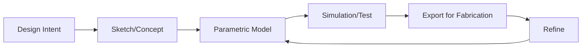

# Digital Modeling

## Overview

This section documents my digital modeling approach, focusing on how computational thinking from IoT/embedded systems translates to parametric design.

## Modeling Approach

### Tools Used
- **CAD Software:** [Specify: Fusion 360, Rhino, Grasshopper, etc.]
- **Parametric Tools:** [If applicable]
- **File Formats:** STL, STEP, OBJ, etc.

### Workflow

## Key Projects

### Project 1: [Project Name]

**Design Intent:**  
[Describe what you were trying to achieve]

**Modeling Strategy:**  
[Explain your approach - parametric relationships, constraints, etc.]

**Screenshots:**

*Caption: Brief description of what the image shows*

**Files:**  
- [Download Model File](assets/model1.f3d)

---

### Project 2: [Project Name]

[Repeat structure as above]

## IoT Integration Considerations

As an IoT engineer, I considered:

- **Enclosure design** for electronics components
- **Mounting points** for sensors and PCBs
- **Cable management** pathways
- **Heat dissipation** requirements
- **Assembly/disassembly** for maintenance

## Challenges & Solutions

!!! warning "Challenge 1"
    **Issue:** [Describe problem]  
    **Solution:** [How you solved it]

## Learnings

- Key insight 1
- Key insight 2
- Key insight 3
