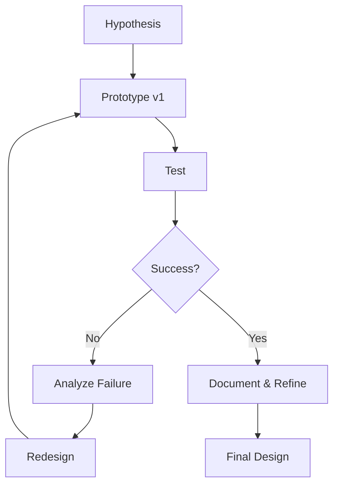

# Prototyping & Iteration

## Philosophy

> "Failure is a learning tool"

Prototypes serve as research tools and assumption tests in the design inquiry process.

## Iteration Cycle

## Prototype Series

### Prototype 1: Initial Concept

**Goal:** Test basic form and fit

**Method:** Rapid 3D print with low infill

**Results:**
- ✅ Form validated
- ❌ Structural weakness at joint
- ❌ Tolerance too tight for assembly

**Images:**

*First iteration - identified structural issues*

---

### Prototype 2: Structural Refinement

**Changes Made:**
- Increased wall thickness from 2mm to 3mm
- Added ribbing for reinforcement
- Adjusted clearances to +0.3mm

**Results:**
- ✅ Improved strength
- ✅ Better assembly fit
- ⚠️ Weight increased 15%

---

### Prototype 3: Material Exploration

**Experiment:** Testing different materials

| Material | Strength | Flexibility | Cost | Result |
|----------|----------|-------------|------|--------|
| PLA | Medium | Low | Low | Brittle failure |
| PETG | High | Medium | Medium | ✅ Best option |
| TPU | Low | High | High | Too flexible |

---

### Final Prototype

**Refinements:**
- Material: PETG
- Optimized geometry based on stress testing
- Final tolerances documented

*Final iteration ready for production*

## Testing Documentation

### Test 1: Structural Load

**Setup:** [Describe test method]  
**Load Applied:** [Specify]  
**Result:** [Pass/Fail with data]

### Test 2: Assembly Time

**Metric:** Time to assemble components  
**Target:** < 5 minutes  
**Actual:** 3 minutes 45 seconds ✅

## Failures & Learnings

!!! failure "Major Failure: Snap-fit Breakage"
    **What happened:** Clips broke during assembly  
    **Root cause:** Insufficient draft angle  
    **Fix:** Redesigned with 5° draft, thicker base  
    **Lesson:** Always prototype assembly mechanisms first

!!! failure "Material Warping"
    **What happened:** Large flat surfaces warped during printing  
    **Root cause:** Inadequate bed adhesion, cooling  
    **Fix:** Added brim, enclosed printer, slower cooling  
    **Lesson:** Large parts need environmental control

## Key Insights

1. **Prototype early and often** - catching issues early saves time
2. **Test one variable at a time** - isolate what causes success/failure
3. **Document everything** - patterns emerge from detailed notes
4. **Embrace failure** - each failure teaches more than success
